## Skill Visualization

For each domain, we show two rows:
* in the first row, we show the skill code reconstructions
* in the second row, we show the corresponding skills deployed in the environment for 100 steps

#### Walker

    
    
    
    
    
    
    
    

    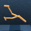
    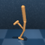
    
    
    
    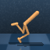
    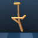
    

&nbsp; 

#### Quadruped

    
    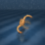
    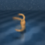
    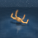
    
    
    
    

    
    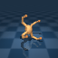
    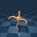
    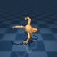
    
    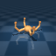
    
    

&nbsp; 

#### Jaco

    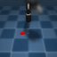
    
    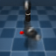
    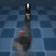
    
    
    
    

    
    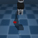
    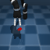
    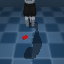
    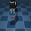
    
    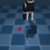
    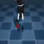

&nbsp; 

#### Meta-World

    
    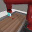
    
    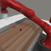
    
    
    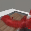
    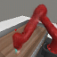

    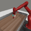
    
    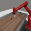
    
    
    
    
    

&nbsp; 
&nbsp; 
